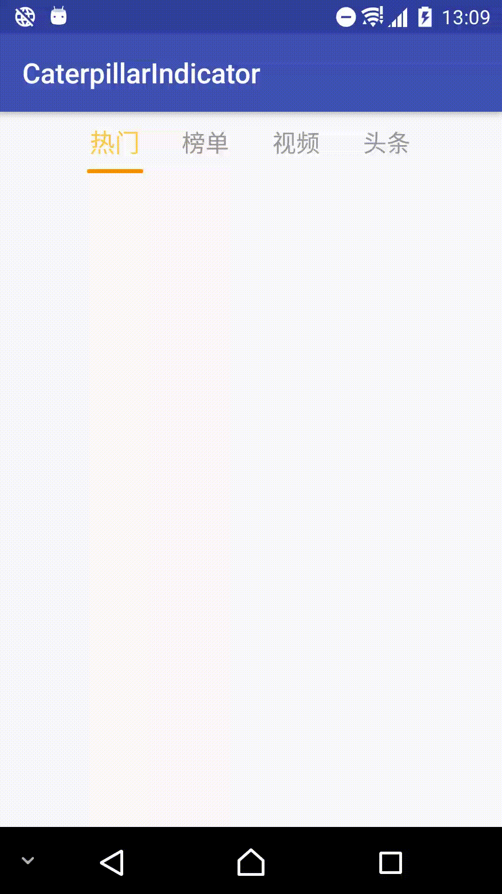

# CaterpillarIndicator
类似毛毛虫爬动的ViewPage指示器,参考新浪微博滑动效果实现
 
##Gradle
```java
dependencies{
  compile 'com.chaek.android:caterpillarindicator:1.1.0'
}
```

##XML
```xml
 <com.chaek.android.widget.CaterpillarIndicator
    android:id="@+id/title_bar"
    android:layout_width="match_parent"
    android:layout_height="44dp"
    android:layout_marginLeft="50dp"
    android:layout_marginRight="50dp"
    app:slide_item_width="30dp"
    app:slide_caterpillar="true"
    app:slide_footer_color="#fc9001"
    app:slide_text_size_normal="17sp"
    app:slide_text_size_selected="18sp"
    app:slide_footer_line_height="3dp"
    app:slide_round="true" />    
```
##Demo




 
 
 
